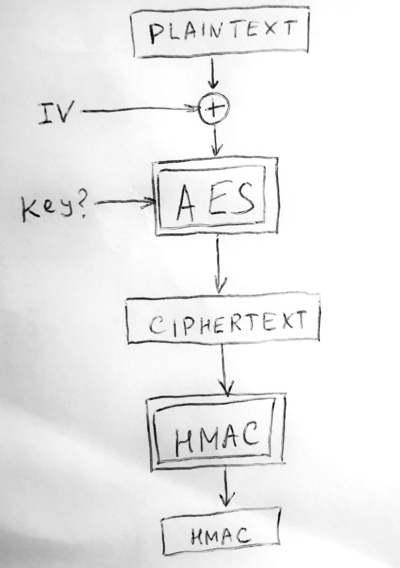

# Day 14

> Santa’s elves created a brand new API for naughty and nice list at http://elfs.owasp.si:8000/ with advanced protections. But did they get the protections right? Be nice.

Let's use some tool for HTTP endpoints enumeration. My favorite tool for that is [ffuf](https://github.com/ffuf/ffuf), and the default wordlist is [big.txt](https://github.com/danielmiessler/SecLists/blob/master/Discovery/Web-Content/big.txt).

```
$ ffuf -w ~/hacking/wordlists/SecLists/Discovery/Web-Content/big.txt -u http://elfs.owasp.si:8000/FUZZ

        /'___\  /'___\           /'___\       
       /\ \__/ /\ \__/  __  __  /\ \__/       
       \ \ ,__\\ \ ,__\/\ \/\ \ \ \ ,__\      
        \ \ \_/ \ \ \_/\ \ \_\ \ \ \ \_/      
         \ \_\   \ \_\  \ \____/  \ \_\       
          \/_/    \/_/   \/___/    \/_/       

       v1.1.0-git
________________________________________________

 :: Method           : GET
 :: URL              : http://elfs.owasp.si:8000/FUZZ
 :: Follow redirects : false
 :: Calibration      : false
 :: Timeout          : 10
 :: Threads          : 40
 :: Matcher          : Response status: 200,204,301,302,307,401,403
________________________________________________

submit                  [Status: 200, Size: 142, Words: 12, Lines: 1]
:: Progress: [20473/20473] :: Job [1/1] :: 71 req/sec :: Duration: [0:04:48] :: Errors: 0 ::
```

Great, we found this endpoint: <http://elfs.owasp.si:8000/submit>. Here is what is says:

```
Arguments list, iv and hmac are required. Example values naughty=1&nice=2, 00000000000000000000000000000000, 23e75787ce7a289a4fb0bff3973ae5c0.
```

Let's try to [submit the given values](http://elfs.owasp.si:8000/submit?list=naughty=1%26nice=2&iv=00000000000000000000000000000000&hmac=23e75787ce7a289a4fb0bff3973ae5c0).

```
Args ok, signature valid but you've been naughty.
```

So we need to find a way to change `list` contents but at the same time, get the correct signature. Note that `list` value is actually 16 bytes. Where else we have 16 bytes of data? Right, in the initialization vector (`iv` argument) and `hmac`. This might point to AES encryption, but we don't know the key.

The trick is that we don't really need it. HMAC is calculated based on ciphertext. And if we manage to produce the same ciphertext with altered plaintext, then the signature would be correct, and we're fine. Also take into account that the `iv` is controlled by us.

One of the AES encryption modes which is vulnerable to that, is CBC. Also, we have just one data block, so the schema simplifies to:



According to this schema, the input for AES function is `plaintext XOR iv`. We control both plaintext and initialization vector. Therefore, we can alter them at the same time, thus preserving the `plaintext XOR iv` value. Here is [the program](solution.py) which does this attack. The retrieved flag is:

```
xmas{Cbc_hmAC_1s_nauGhty!}
```
