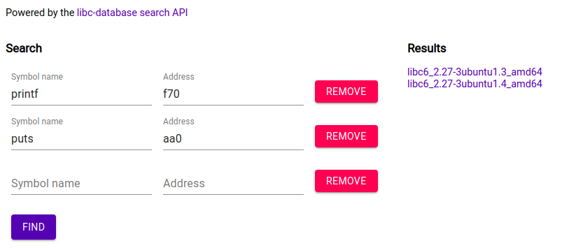

# Day 22

> Santa’s elves fixed some formatting errors from the old app, but he might have introduced some new bugs. Can you find them? elfs.owasp.si:40005

[baby_format](baby_format)

This time, we are dealing with [format string vulnerability](https://owasp.org/www-community/attacks/Format_string_attack).

This article helped me a lot: [Leak libc addresses from GOT to exploit unknown Libc, bypassing ASLR Remotely 64 bit](https://www.ret2rop.com/2020/04/got-address-leak-exploit-unknown-libc.html)

See the source decompiled with Ghidra: [source.c](solution/source.c)

First, we start with leaking GOT entries from remote server, which will help us to identify remote libc version. Use this [exploit](solution/leak_got.py) which implements reading arbitrary memory trick.

```
$ ./leak_got.py printf
...
[+] Leaking GOT entry for "printf": 0x7f8b723c9f70
 
$ ./leak_got.py puts
...
[+] Leaking GOT entry for "puts": 0x7fb852056aa0
```

Due to ASLR enabled on remote server, the first part of the functions' addresses will be randomized, but the last 3 hex digits will always be the same (due to memory page boundary alignment). In our case, we get:

```
printf: f70
puts:   aa0
```

We can use [libc versions database](https://libc.rip/) to identify the specific libc version which is used remotely:


We can [download this version](https://libc.rip/download/libc6_2.27-3ubuntu1.3_amd64.so) and use it for further exploit development.

Now, knowing current address of `puts` function (for example) and the offset of `puts` in this specific libc version, we can derive the base address of libc.

We already know all functions' offsets in this libc library. So we can finally exploit the buffer overflow to jump to `execve` with argument of address of the `/bin/sh\x00` string. Hopefully, it is found in this libc version.

See [the full solution](solution/solution.py)
